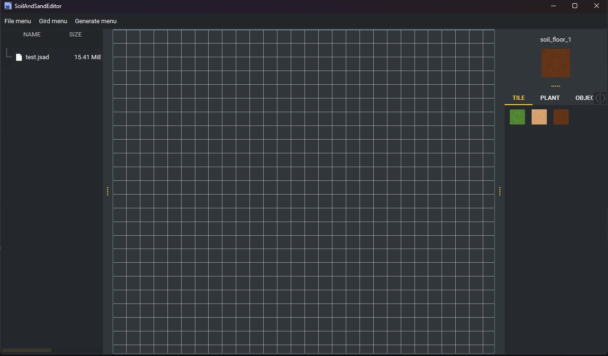

# Yeah, this is a simple 2D tile map editor made with Python and PySide6.

* File menu
  * You can create new map via File menu.
  * You can save / read file via File menu. (file extension is jsad)

* Grid menu
  * You can open / close grid support.

* Generate map menu
  * Use perlin noise to generate map.

* File tree on left
  * Show all jsad file on current folder.
  * You can click jsad file to read it.

* Map editor on center
    * You can press mouse right button to place tile
    * You can double click mouse left button to remove tile
    * You can zoom in and zoom out tile_map
  
* Tile selector on right 
  * Top of tile group show current tile
  * You can switch tab to change tile group
  * You can choose tile on tile area
